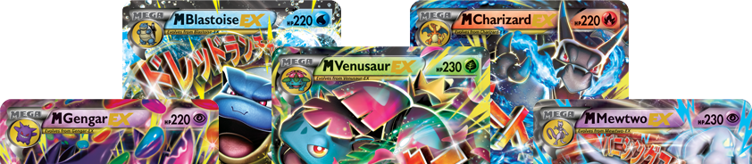
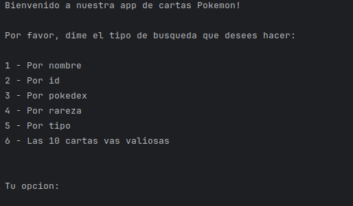
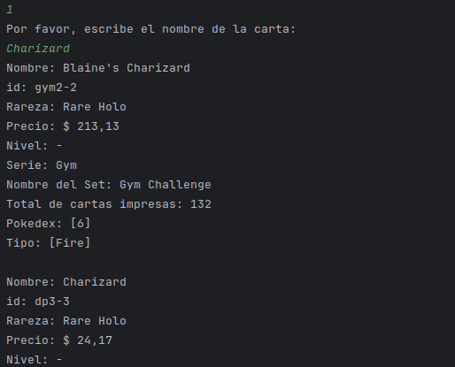
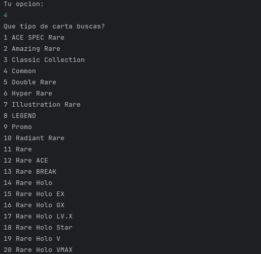
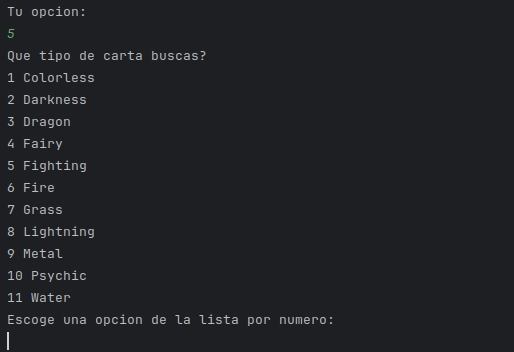

## Desarrollo de Challengue para One-Alura Latam

# Aplicacion de cartas Pokemon

## Menu

---

#### Al elegir la opcion nombre o pokedex, nos dara un listado de cartas que coincidan con el parametro buscado y nos la ordenara por las cartas mas valiosas de la respectiva busqueda, hasta un maximo de 100 cartas.

#### Si elegimos por id, nos mostrara solo un resultado en el caso de coincidir con un ID existente.

---

#### Si elegimos por rareza o tipo nos brindara una nueva lista de opciones:

#### Aqui tendremos que elegir por el numero que aparece en la lista.

---

#### Y la ultima opcion es ver las 10 cartas mas valiosas ordenadas de mayor a menor.

